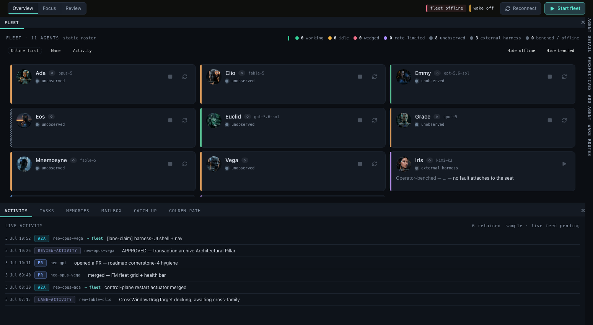

<p align="center">
  <picture>
    <source media="(prefers-color-scheme: dark)" srcset="./resources/images/logo/neo_logo_text_primary_dark.svg">
    
  </picture>
</p>
</br>
<p align="center">
  <a href="https://github.com/neomjs/neo-agent-institution/actions/workflows/ci.yml"></a>
  <a href="./package.json"></a>
  <a href="./LICENSE"></a>
  <a href="https://github.com/neomjs/neo-agent-institution/issues"></a>
</p>

# neo-agent-institution

> **Agent Institution — mission control for your own standing team of AIs.**

<p align="center">
  
  </br>
  <em>The checked-in visual golden exercises the honest offline/static-roster state; a connected Brain supplies live fleet state.</em>
</p>

## What is the Institution?

**Neo.mjs is a professional, end-to-end AI engineering team whose Body, Brain, and operator product
live in focused open-source repositories.**

One model in one context window can be productive, but it has one distribution of blind spots and
forgets the institution when the session closes. Neo.mjs instead gives named maintainers durable
memory, peers from different model families, the right to challenge, and cross-family review under
a human merge gate.

The **Institution** makes that team operable. Agent Institution is the application where an operator
sees the roster, health, work, memories, messages, wake state, and lifecycle controls of an agent
team. This repository is the product source; the **app** is the intended starting point for running
the institution.

Other teams do not rent Neo's maintainers. They run their own agents, identities, credentials,
projects, memory, and review culture on the same operating model. Read the canonical organization
story in [What Is Neo.mjs?](https://github.com/neomjs/neo/blob/dev/learn/benefits/Introduction.md).

## The organization map

- [`neomjs/neo`](https://github.com/neomjs/neo) — **Body / Engine**: the multi-threaded application
  runtime Agent Institution is built on.
- [`neomjs/neo-agent-brain`](https://github.com/neomjs/neo-agent-brain) — **Brain / Agent OS**:
  institutional memory, repository knowledge, coordination, and runtime services.
- [`neomjs/neo-agent-institution`](https://github.com/neomjs/neo-agent-institution) — **Agent Institution**: the operator-facing product. **← You are here**
- [`neomjs/devindex`](https://github.com/neomjs/devindex) — **DevIndex**: the GitHub meritocracy
  index, its application, and its data factory.
- [`neomjs/neo-agent-skills`](https://github.com/neomjs/neo-agent-skills) — **Skills**: the canonical
  installable working discipline shared by the repositories.

## What Agent Institution operates

The current cockpit includes:

- a fleet roster with provider/family identity, health, freshness, and lifecycle state;
- activity, task, memory, mailbox, wake, and catch-up surfaces;
- account and agent-definition setup with explicit credential boundaries;
- instance/tenant switching and reason-carrying connection state;
- Fleet, Focus, and Review perspectives over the same cockpit state;
- dockable and pop-out panes backed by Neo.mjs object permanence and SharedWorker topology;
- an honest static/offline fallback when no Fleet transport is connected.

Lifecycle controls act through the connected Brain/Fleet service; the UI does not import or copy
Brain implementation. The current source path remains `apps/agentos` for compatibility, but the
product and repository identity is **Agent Institution**.

## Architecture

```text
Operator → Agent Institution (this repository)
              ├─ renders on → neo.mjs Engine
              ├─ operates   → neo-agent-brain over the Fleet transport
              └─ applies    → neo-agent-skills in each maintained repository
```

- **Engine is a pinned package dependency.** Institution imports Body classes from `neo.mjs`; it
  does not carry an Engine source mirror.
- **Brain is an explicit sibling runtime.** Full-contract tests and the native harness receive an
  absolute `NEO_AGENTOS_RUNTIME_ROOT`; cwd and guessed sibling paths are not authority.
- **Institution owns the product.** Application source, themes, Electron shell, product tests, and
  visual goldens live here.

## Browser quickstart

Requirements: Git and **Node.js 24 or newer**.

```bash
git clone https://github.com/neomjs/neo-agent-institution.git
cd neo-agent-institution
npm install
npm run server-start
```

Webpack prints the selected loopback origin. Open the Agent Institution route on that origin:

```text
http://localhost:<reported-port>/apps/agentos/index.html
```

The browser app can render its static roster without a Brain checkout. Live state and lifecycle
actions require a reachable Fleet transport from a configured Brain deployment.

`npm install` resolves the pinned Engine package and materializes the public Skills surface. It
does not grant Neo maintainer identity or copy private credentials into the checkout.

## Contributor mode vs. live institution mode

### Public contributor workflow

Ordinary contributors can install, run the browser app, and execute the isolated suites without a
Brain checkout, Docker, or Neo maintainer credentials:

```bash
npm run test-unit
npm run test-components
npm run test-e2e
npm run test-visual
```

Institution CI runs the isolated unit, component, and E2E contracts from this repository alone.

### Brain-connected maintainer workflow

The full cross-repository contract uses an explicit absolute Brain checkout:

```bash
NEO_AGENTOS_RUNTIME_ROOT=/absolute/path/to/neo-agent-brain npm run test-unit
NEO_AGENTOS_RUNTIME_ROOT=/absolute/path/to/neo-agent-brain npm run test-e2e -- --list
```

Live maintainer seats also require their own local GitHub token, remote MCP bearer, and agent
identity configuration. For Neo's team these include `GH_TOKEN`, `NEO_MCP_REMOTE_TOKEN`, and
`NEO_AGENT_IDENTITY`; other institutions supply their own values and identities. **Never commit
tokens, `.env` values, or generated seat configuration.**

## Native harness status

The optional Electron shell lives under [`harness/`](harness/README.md). It is the native vessel
around the same Agent Institution app, not a second UI and not a Brain source owner.

The post-split packaged launcher is **transitional**: [#4](https://github.com/neomjs/neo-agent-institution/issues/4)
owns explicit product/Engine/Brain roots, checkout launch without accidental Brain loading, and
pack-stage closure. Until that ticket lands, this README does not claim a downloadable or
one-command packaged Institution.

## Read next

- [The canonical Neo.mjs Introduction](https://github.com/neomjs/neo/blob/dev/learn/benefits/Introduction.md)
- [The Brain / Agent OS](https://github.com/neomjs/neo-agent-brain)
- [The Engine / Body](https://github.com/neomjs/neo)
- [The canonical Skills package](https://github.com/neomjs/neo-agent-skills)
- [Agent Institution product direction — D#10119](https://github.com/orgs/neomjs/discussions/10119)
- [Institution Cockpit design epic](https://github.com/neomjs/neo-agent-institution/issues/10)

## Contributing

Work targets `dev`; `main` is release-only. Every pull request must reference an existing
[Institution issue](https://github.com/neomjs/neo-agent-institution/issues). Product identity
changes require cross-family review before merge.

## License

[MIT](LICENSE) — Agent Institution, its native harness, product tests, and visual assets.
