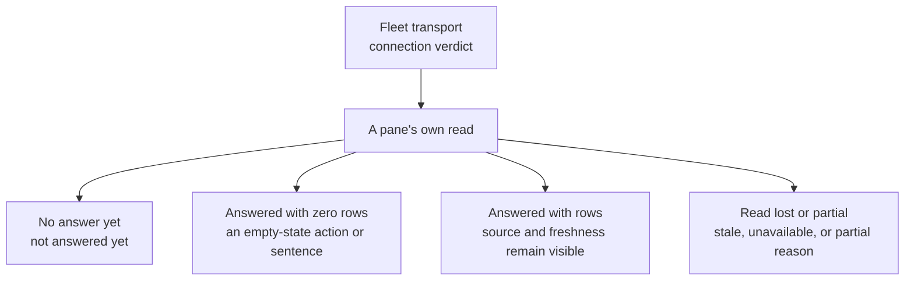

# Tour the cockpit: read the answer behind the picture

The first question in a cockpit is rarely “which button should I click?” It is “what has this view actually heard?” A blank roster can mean no agent exists, no Fleet transport is connected, or no read has completed. A busy-looking task list can be a layout example. Agent Institution keeps the data answer and the connection verdict close enough that you can tell those situations apart.

## Start with the connection line

On a browser boot without a Fleet transport, the spine says **fleet offline**. That is a transport verdict. It does not certify whether the registry is empty or populated. The instance control names the selected Fleet endpoint and whether it is connected. A nearby wake marker has its own status; in my cold local read it said **wake off** and explained that polling remains the truth lane when the wake stream is disconnected. Those two indicators describe different paths.

The arrows are questions to ask of a view, not a guaranteed sequence of transitions. A healthy connection may still serve a failed or partial producer. The banner and the pane therefore have separate jobs: the banner reports the transport, and the pane reports what its source returned.

## Move from roster to the reading strip

**Fleet** is the roster's home. Its cards carry the identity, session state, and actions of reported agents. The header can show **not answered yet** while the source is cold; it withholds the empty-team invitation in that state. When a live roster answer is empty, it offers **Add your first agent**. A stale roster can retain last-known cards and say **stale — reconnecting** rather than clearing the picture. The working, idle, stuck, rate-limited, and offline legend names session-state categories; a separate presence warning can say **presence unobservable** when that part of the read degraded. The [card contract](../apps/agentos/CARD-CONTRACT.md) is the developer authority for the card's detailed fields.

**Activity** records what the feed has retained. On my cold boot it read **0 retained · not answered yet**. A completed empty answer instead says **no activity yet**. A partly working feed says **partial — some sources unavailable**, preserving useful rows while naming the gap. A live feed whose newest event is old gives its instant without guessing whether the team was quiet or a source stopped delivering. These words prevent a quiet display from turning into a false claim about the team's work.

**Tasks** separates Running, Queued, and Recent work. In the current source build I opened, the read failed and the pane said: **Tasks unavailable — the rows below show the shape, not the deployment.** Its visible example rows carried **sample** pills. A sample pill is not a Fleet answer. Read the pane's capability sentence before treating a task name, count, wait, or maintenance lease as operational truth. A wired snapshot can carry actual task rows and a scheduler summary; the [tasks design sketch](../apps/agentos/design/institution-tasks-queue.html) explains the intended density and provenance grammar.

**Memories** first needs an agent selection. Without one, the pane asks you to select a card to read recent sessions. Its subtitle says **session summaries · query-time · not authority**: a summary helps navigation, while the underlying record remains the authority for a decision. **Mailbox** similarly distinguishes a feed from a compose form. On my cold boot it said **Mailbox feed not wired** even though recipient, subject, message, priority, and Send controls were visible. A visible form is an affordance; it is not a delivery receipt.

The remaining panes keep the same discipline. **Catch up** is a query-time account of what changed since a selected window; it can name an unavailable source rather than synthesizing a story from missing inputs. **Wake Routes** starts with **Read routes**, then describes each seat's route axes instead of fusing them into one reassuring light. The right rail also opens Agent Detail, Add Agent, and **Perspectives**. In my read, Perspectives listed Overview, Focus, and Review, with Overview active; applying a layout changes the arrangement of the same cockpit, not the ownership of its data.

## Look beyond Fleet without losing the question

The left navigation exposes Home, Fleet, Observatory, System, Accounts, and Chat. Observatory is the graph reading surface; on my disconnected boot it said its Fleet graph scene read failed. System showed **not observed yet**, no plane cards, and a logs region explicitly marked **not wired yet**. These are useful places to look precisely because they name the missing observation instead of filling it with a decorative success state. Accounts is where agent definitions and credentials are managed; [Running the Institution](RunningTheInstitution.md) explains which runtime owns the connection. Dock tabs and the rail can rearrange or reveal panes, while the source and freshness wording stays the thing to trust.

When the picture looks surprising, read in this order: connection verdict, pane capability, then rows or controls. That small habit turns the cockpit from a collection of widgets into a tool for deciding what is known and what still needs a real read.
