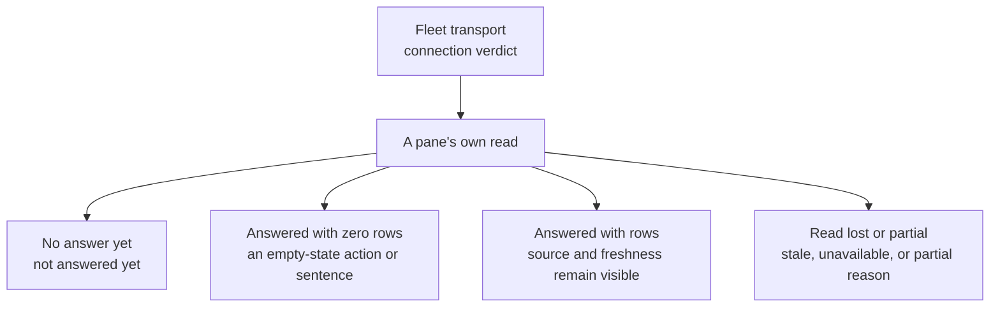

# Tour the cockpit: read the answer behind the picture

The first question in a cockpit is rarely “which button should I click?” It is “what has this view actually heard?” A blank roster can mean no agent exists, no Fleet transport is connected, or no read has completed. Agent Institution keeps the data answer and the connection verdict close enough that you can tell those situations apart. I made this tour in two passes: a cold browser boot and a native vessel attached to a saved plane.

## Start with the connection line

On a browser boot without a Fleet transport, the spine says **fleet offline**. That is a transport verdict. It does not certify whether the registry is empty or populated. The instance control names the selected Fleet endpoint and whether it is connected. A nearby wake marker has its own status; in my cold local read it said **wake off** and explained that polling remains the truth lane when the wake stream is disconnected. Those two indicators describe different paths.

The arrows are questions to ask of a view, not a guaranteed sequence of transitions. A healthy connection may still serve a failed or partial producer. The banner and the pane therefore have separate jobs: the banner reports the transport, and the pane reports what its source returned.

## A connected read can still be partial

On 2026-09-29 I opened a newly built native vessel against a saved Agent OS plane. Its instance control reached **connected**, while the cockpit spine also said **agent os degraded**. Both were true: the transport could answer, and the organism still had gaps. The roster returned an empty answer with the first-agent action. Activity brought in 50 recent events. Tasks returned a captured orchestrator snapshot. System listed five services as serving, but also said the backup lane was exhausted. It marked Memory Core as serving while Tasks marked its Memory Core source unavailable: service status and this pane's read are separate observations. The Observatory's graph read failed. This was a much more useful picture than either “all live” or “all offline.” The counts are one observation of this team, not promises about another deployment.

## Move from roster to the reading strip

**Fleet** is the roster's home. Its cards carry the identity, session state, and actions of reported agents. The cold browser header showed **not answered yet** and withheld the first-agent action. The connected vessel answered with zero agents and offered **Add your first agent** instead. The working, idle, stuck, rate-limited, and offline legend stayed visible in both cases; zero rendered cards only became an empty-fleet answer when the live read completed. The [card contract](../apps/agentos/CARD-CONTRACT.md) is the developer authority for the card's detailed fields and retained-state behavior.

**Activity** records what the feed has retained. On my cold boot it read **0 retained · not answered yet**. In the connected vessel it showed **50 retained · streaming** and a source-qualified mailbox total, with recent messages in the list. The newest event was fresh, so the header did not show a “quiet since” time; that conditional branch was not witnessed here. A completed empty answer has its own **no activity yet** sentence in the source, which is distinct from both observations. The source count describes that source's total, while the retained number describes the list in view.

**Tasks** separates Running, Queued, and Recent work. The connected read was captured at 15:46: one Running row, six known Queued rows, and ten Recent rows. It identified the orchestrator source as live and displayed the maintenance lease beneath the Queued heading. The same line said Memory Core was unavailable and Knowledge Base not reachable. A populated section was therefore useful without making the other sources healthy. The [tasks design sketch](../apps/agentos/design/institution-tasks-queue.html) explains the intended density and provenance grammar. On my earlier cold browser boot, this pane instead said **Tasks unavailable — the rows below show the shape, not the deployment** and still displayed rows marked **sample**. Those are an interim display, never evidence of work; read the capability sentence before trusting any task name, count, wait, or lease.

**Memories** first needs an agent selection. Without one, the pane asked me to select a card to read recent sessions; the connected roster was empty, so I did not claim a memory result. Its subtitle says **session summaries · query-time · not authority**: a summary helps navigation, while the underlying record remains the authority for a decision. **Mailbox** similarly distinguishes a feed from a compose form. On the cold boot it said **Mailbox feed not wired** even though compose controls were visible. On the connected vessel its head instead reported a recent update. A visible form or refreshed feed is still no receipt for a message the operator has not sent.

The remaining panes keep the same discipline. Connected **Catch up** began with **No runtime anchor yet** and asked me to choose 24 hours, three days, or a week; it invented no history window. **Golden Path** displayed a computed recommendation with ranked work from its captured read. **Wake Routes** starts with **Read routes**, then describes each seat's route axes instead of fusing them into one reassuring light. The right rail also opens Agent Detail, Add Agent, and **Perspectives**. In my read, Perspectives listed Overview, Focus, and Review, with Overview active; applying a layout changes the arrangement of the same cockpit, not the ownership of its data.

## Look beyond Fleet without losing the question

The left navigation exposes Home, Fleet, Observatory, System, Accounts, and Chat. **System** was empty on the browser boot. On the connected vessel it showed five services as serving, distinguished healthy from advisory diagnoses, and reported an exhausted backup lane. Its logs region still said **not wired yet**. **Observatory** remained unavailable on that same connected plane: **GRAPH-READ-FAILED**, no nodes, no route drawn. I cannot show a graph journey from this read and do not treat the canvas controls as proof that one occurred. The instance selector named the saved plane; it opened with no second instance to choose, so switching between instances was not witnessed. Accounts is where agent definitions and credentials are managed; [Running the Institution](RunningTheInstitution.md) explains which runtime owns the connection. Dock tabs and the rail can rearrange or reveal panes, while the source and freshness wording stays the thing to trust.

When the picture looks surprising, read in this order: connection verdict, pane capability, then rows or controls. That small habit turns the cockpit from a collection of widgets into a tool for deciding what is known and what still needs a real read.
