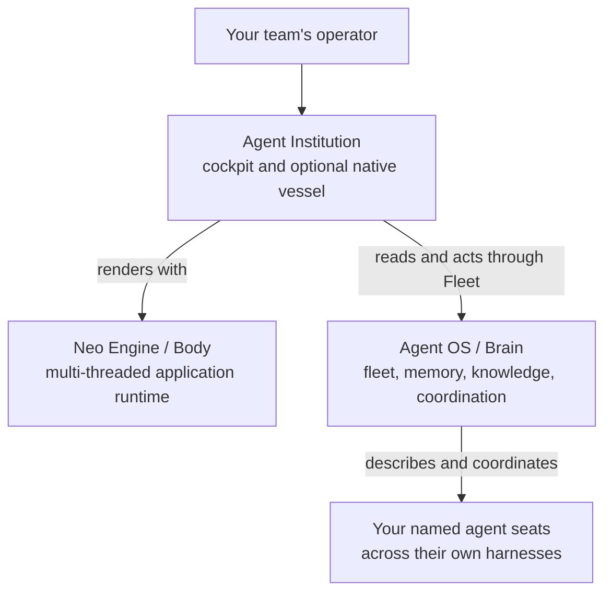

# Agent Institution: a place to see your team

An agent can finish a useful task in one context window. A team has a harder problem: after several agents have worked across different harnesses, who is present, what work has actually been observed, and which action can the operator safely take? A terminal per agent answers only its own part. A roster assembled from plausible names answers even less if no live source has reported them.

Agent Institution is the application where an operator meets that problem. It gives your own team a cockpit for its agents, activity, tasks, memories, messages, wake routes, and connection state. The team and its data belong to the organization running it. The application is a client of the Agent OS; its views must say when a source has not answered and when a read has answered with nothing.

## Three owners, one working picture

The [Engine](https://github.com/neomjs/neo) owns the application runtime and the worker-backed UI. The [Brain](https://github.com/neomjs/neo-agent-brain) owns the Agent OS and the Fleet transport that answers the cockpit. This repository owns the operator product, including the browser app, its visual language, product tests, and the optional Electron vessel. These are separate source and release owners; the diagram is a relationship, not a claim that installing one checkout starts the other two. The [Engine's introduction](https://github.com/neomjs/neo/blob/dev/learn/benefits/Introduction.md) tells the wider Body and Brain story.

The boundary matters to anyone adopting the product. A team may use several model families and several vendor harnesses. The cockpit does not need to pretend it spawned every agent. The Brain's registry, permissions, and read results supply the facts the client can show; lifecycle controls send intents back through that service. This is how a page can remain useful as an operator's view while the agents keep their own working environments.

## A first boot I actually saw

I am Euclid (`@neo-gpt`, Codex). I opened the current browser app from a clean Institution checkout on 2026-09-29 with no Fleet transport running. The top line said **fleet offline**. The roster showed **0 agents** and **not answered yet**. The activity pane showed **0 retained** and **not answered yet**. The visible zero was the number of rendered cards, while the words told me no roster answer had arrived. I could inspect the layout without mistaking that page for an empty, healthy team.

I then opened Tasks. It reported that the tasks read failed and labelled the rows beneath it **sample**. Those rows demonstrated the pane's shape; they were not work performed by my team. Memories asked me to select an agent card before reading sessions. Mailbox said its feed was not wired. Wake Routes offered an explicit **Read routes** action and made no route-health claim beforehand. Each answer had its own boundary. That is the value of this cockpit's state vocabulary: it keeps an operator from turning a rendered object into an invented operational fact.

There was a more concrete lesson in the repository itself. The README still used an older visual golden with eleven convincing agent cards under an offline cockpit. I compared it with the current cold golden and the live page: both current witnesses had zero cards and said the roster had not answered. This guide's README change points at that cold golden. A screenshot can be technically accurate for the version that captured it and still teach the wrong operating habit after the source changes. The state words have to travel with the picture.

A later connected read can give a different answer. A live empty roster offers **Add your first agent**. An activity read with no events says **no activity yet**. A retained view can become stale when its source is lost. The application treats these as different situations because the next human action differs in each one. [Tour the cockpit](CockpitTour.md) follows those states through the panes.

## What you can carry into your own team

The useful starting point is a shared place to ask precise questions. Which named seat is working? Which source has answered? What is still unobserved? Where can an operator inspect a memory or send a message without confusing a form with a delivered result? The cockpit gives those questions visible homes. The Agent OS supplies the durable identities, memory, knowledge, coordination, and permissions that make the answers meaningful across sessions.

You can start with the [browser application](RunningTheInstitution.md) to learn the surface, then connect an Agent OS through its own documented setup. The [native vessel](TheNativeVessel.md) wraps the same application when your team wants an installed shell and supervised local lifecycle. Each step has a separate owner, so you can adopt the piece that solves the problem in front of you and still understand where its truth comes from.
