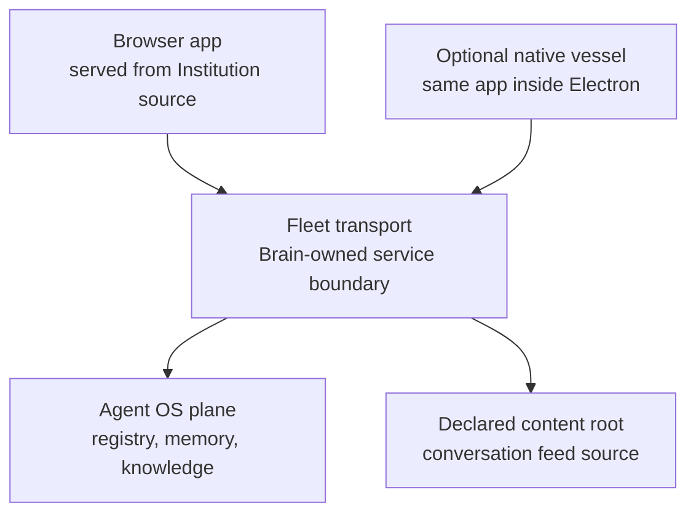

# Run the Institution: start with a truthful page

A first visit does not require a running Agent OS. It requires the Agent Institution source checkout, Node.js 24 or newer, and a browser. The [README browser quickstart](../README.md#browser-quickstart) gives the current install and dev-server commands; open the route the server reports for `apps/agentos/index.html`. This is a useful way to learn the app without borrowing another team's credentials or mistaking a test fixture for a live fleet.

On that source-only boot, expect a cold page. In my local run, the selected instance named a loopback Fleet endpoint but said **not connected**; the spine said **fleet offline**; roster and activity said **not answered yet**. The application itself had loaded. The Agent OS had not supplied those reads. That distinction is the first operational check: a rendered page proves the client is running, while a pane's own capability and state words say whether its producer answered.

## Connect the owner of the answers

The Agent OS lives in the [Brain repository](https://github.com/neomjs/neo-agent-brain). Its Fleet transport is the boundary through which the browser client reads and sends lifecycle intents. The Brain's [local Agent OS runbook](https://github.com/neomjs/neo-agent-brain/blob/dev/ai/scripts/lifecycle/local-agent-os/README.md) owns the current plane startup, credential custody, and host transport binding. Follow that authority for a live deployment; this guide keeps the map small enough to recognize what each process does.

The host Fleet process uses an explicitly declared plane base and an identity-bound plane bearer when it attaches to a plane. Its activity feed also reads a declared content root. In the Brain's config these are the `NEO_FLEET_PLANE_BASE`, `NEO_FLEET_PLANE_BEARER`, and `NEO_FLEET_CONTENT_ROOT` inputs. They are Brain-side configuration and secret custody, not fields to paste into the browser app or this repository. A nonempty plane base declares topology; it does not prove the plane is healthy. The [Brain runbook](https://github.com/neomjs/neo-agent-brain/blob/dev/ai/scripts/lifecycle/local-agent-os/README.md#bind-the-host-fleet-transport-to-this-plane) gives the concrete binding and verification steps.

The checkout's [contributor workflow](../README.md#contributor-mode-vs-live-institution-mode) can run isolated product suites without a Brain checkout. Full contract and Neural Link witnesses need an explicit absolute `NEO_AGENTOS_RUNTIME_ROOT`; a current working directory or guessed sibling checkout is not an authority. Keeping the source test path separate from a live connection makes a green isolated test useful evidence for code behavior without presenting it as proof of a deployed Agent OS.

## Read the result, then act

After connecting, verify a pane's answer rather than stopping at the banner. In my native saved-plane read, the roster answered empty and offered the first-agent path, Activity streamed recent events, and Tasks showed orchestrator work while two other sources named gaps. Observatory could not read its graph. The transport and pane-level results were different propositions on the same screen. [Tour the cockpit](CockpitTour.md) follows those observations before an operator uses lifecycle controls.

The optional [native vessel](TheNativeVessel.md) adds an installed shell, a supervised local lifecycle, and its own saved plane connection. It does not change which repository owns Fleet truth. Start in the browser to understand the client; choose the vessel when its install and lifecycle properties solve a real operational need.
