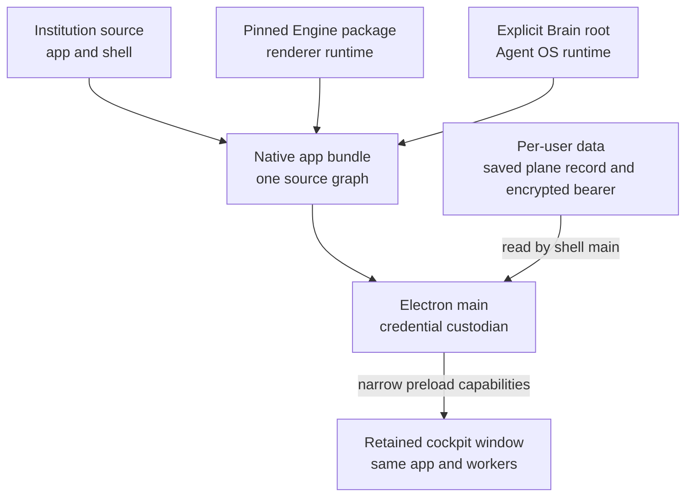

# The native vessel: the same cockpit, held by the machine

A browser tab can show the Institution while another process serves it. An installed operator app has another job: keep the cockpit reachable after its window closes, start the local services it owns, and carry a plane connection across launches without putting credentials into the renderer. The `harness/` directory is that optional native vessel around the same `apps/agentos` application.

The vessel is an Electron shell, not a second product UI. Its package assembles three explicit source owners: this repository's app and shell, the pinned Neo Engine package, and an explicitly selected Brain root. The Brain stays the Agent OS; the Engine stays the Body runtime. The shell supplies the window, a narrow preload capability boundary, packaging, and lifecycle supervision. The [harness runbook](../harness/README.md) owns the precise build and smoke commands.

The data root is drawn outside the bundle for a reason. The packaged shell can save a plane address and identity in its per-user record, with the bearer encrypted through Electron's `safeStorage`. Main process code reads that record; the renderer receives a constrained capability rather than the credential bytes. A bundle replacement does not replace the saved record. If the saved credential cannot be recovered, the shell's connection path asks for a new one instead of silently attaching as someone else.

## What happens at boot

The harness chooses a lifecycle plan before starting children. A declared plane selects **plane-attach**: start the missing Fleet transport and require admission from that plane. Without a declared plane, a proven live host orchestrator selects **attach**: reuse the organism and stop only what this shell started. A genuinely fresh machine selects **own**: start the supervised Agent OS tree. A plane that is temporarily unavailable does not make the shell start a competing organism. Those rules matter more than the window chrome: they keep a convenient launch action from changing who owns the running team.

The packaged app normally boots its Brain; a source checkout keeps that Brain leg opt-in and requires an absolute runtime root. The bundle's build receipt names the Engine pin and Brain revision; the maintainer's delivery receipt must also name the Institution source revision. A running window, a process id, or the shell's development version label alone does not prove which revisions are inside it. The [harness build and verification procedure](../harness/README.md#maintainer-build-and-verification) is the authority for those receipts and the separate saved-plane check.

That distinction mattered during this guide's own read. The installed shell had been staged the day before and reported its Brain child not ready, while the saved plane endpoint still answered. I built a replacement with the newer Brain revision, kept the previous app as a dated backup, and opened the same saved plane without re-entering its credential. The cockpit then streamed activity and showed a real Tasks snapshot. It also said **agent os degraded** and could not draw the Observatory graph. Replacing the bundle corrected the stale shell; it did not manufacture a clean bill of health for every source.

## Moving seat folders

**System → This installation** shows where this copy of the shell keeps its seats. That placement
belongs to the machine running the shell, even when the connected plane runs elsewhere. **Review
move** shows the current and proposed folders and every seat's disposition before **Move seats and
relaunch** records consent. A changed plan needs a fresh review; opening System alone never moves
anything.

The next boot copies and checks the homes before changing their bindings and the recorded root.
This takes time and free space. The original folders are archived after the placement commits and
remain available while the destination is checked. System reports a held move or an unfinished
archive even when the Fleet child cannot start. A placement marked committed is only that: each
peer still needs to resume and verify its own memory, settings and session at the destination.

## Closing the window is a different intent from quitting

When the tray is available, closing the primary cockpit hides it. **Open Cockpit** restores the same window and its worker-backed UI identity. Popup windows keep their normal close behavior. **Quit** is the action that drains the child processes the harness owns. The tray displays a coarse lifecycle projection; it is not a second health service and cannot certify each Fleet source. This is why the cockpit's own roster, activity, task, and connection words remain necessary after the shell says it is running.

The current development distribution is replaced as a whole app. It has no automatic update feed, and signing and notarization remain release work. An operator updating an installed copy should follow [Updating an installed app](../harness/README.md#updating-an-installed-app): preserve the per-user data root, verify the new build receipt, then check a real roster or activity answer. The native vessel makes the Institution easier to keep present on a machine; it does not turn a visual first paint into evidence that every source has answered.
